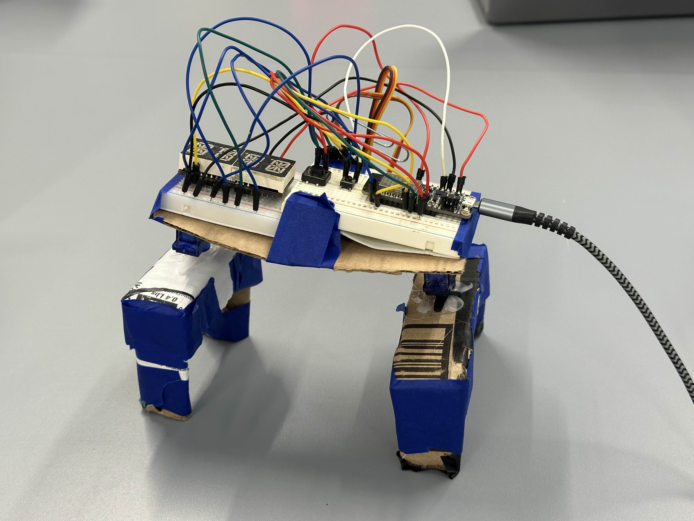
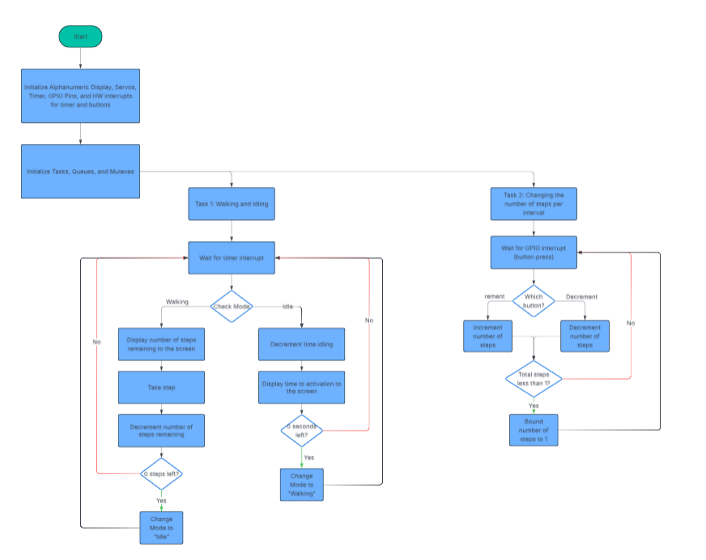
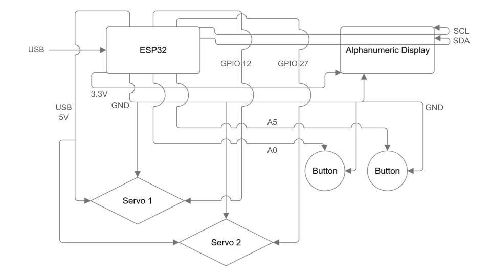

# Four Legged Locomotion 

Authors: Justin Nascimento, Alvin Yan

Date: 2026-02-06

### Summary

In this quest, we needed to build a four legged walker with two modes: an "Idle" mode and a "Walking" mode. Both of these modes are handled in the same RTOS task; this task uses the ESP's internal Hardware timer to wake up the task every second and process the data based on the mode set in the "mode" variable.

When in the "Idle" mode, the ESP decreases the time to activation and reports that number to the alphanumeric display in minutes and seconds.

Once the time hits 0, it changes the mode to the "Walking" mode. When in the "Walking" mode, the walker sets the servos to move in opposite directions, mimicking a walking gait, to take a step and displays the remaining number of steps on the Alphanumeric display. Once the number of steps hits 0, it changes the mode to "Idle."

The time and steps countdown data are passed on to the alphanumeric display task, which translates said data through the font table and sends the bit stream to the display via i2c interface.

Originally, in a separate RTOS task, we constantly check the UART buffer to see if there was a Console Input; if there was, it processed the input and set the number of steps in each interval to that number. As per the "preferred" requirements, we have changed this functionality to button controls, using two buttons to change the step count (one to increment and the other to decrement).

For the servo activation, we implemented another RTOS task to sequentially cycle through a predetermined list of gait phases, using a separate PWM generation timer to generate PWM signals to power the movements in sync.

### Solution Design
We separated all of the relevant functions (i.e., the timer interupt, the display output, button interrupts, and servo actuation) into separate .c files, connected to each other via header files. We then use a main file to combine all the separate functionalities.

We built the body of the bug using two breadboards and a piece of cardboard, staggering the breadboards slightly to introduce an angle for the servos. We then made the legs out of cardboard and attached electrical tape to the bottom/feet to add more friction.

Our 4 legged bug

First, the code initializes the Alphanumeric display, the servo motors, the GPIO pins, the timer, and the hardware interrupts. Then, it initializes two RTOS tasks with queues and mutexes.

The first task contols both walking and idling and is set on a timer interrupt. When the timer fires every second, the "mode" enum variable determines which mode the walker is in. When in "Walking" mode, we update the display with the number of steps remaining, take a step, and decrement the number of remaining steps. If there are 0 steps remaining, we transition to the "Idle" mode. When in "Idle" mode, we decrement the time to activation and update the Alphanumeric display to show it. If there are 0 seconds left, we transition to the "Walking" mode.

The second task is responsible for receiving user input to change the number of steps taken within each walking period. In order to do so, we have two buttons, each tied to the same hardware interrupt but different GPIO pins. When either button is pressed, we have a RTOS task (separate from the one described above) wake up. Then, we can see which GPIO pin was triggered and use that to determine whether or not we need to increment or decrement the number of steps.

Below is a flowchart demonstrating this functionality.

Program Flowchart

Below is our wiring diagram

Wiring Diagram

### Quest Summary
We had originally planned to use 4 servo motors to drive our movement, but we encountered a major issue. Running all 4 servos from the ESP32 board made the servo movements sporadic and unpredictable, and the ESP32 would always turn off/disconnect after a few moments. The issue here is that even though we are powering the servos through the USB 5V pass through, it is still not enough to power both the ESP32 and the 4 servos; each servo draws upwards of 250mA, so 4 servos need 1A to be powered properly. The USB port can only supply 1A maximum, leaving nothing left over for the ESP32 to run. Due to this limitation, we opted to switch back to using 2 servos to actuate our bug's walking motion.

In our final design, all features of the bug works as intended, including the step counter control, the display, the timer, and walking. Although the walk is not perfect, it does move forward.

If we were to do this project again, we'd change the mechanics of our walking. First, we'd 3D print a chassis to provide us with a stronger base then what we currently have, which is just cardboard and tape. Moreover, we'd implement a third servo motor in the middle of our chassis to rotate the chassis. We hope these changes would improve the efficiency of our walking motion.

### Investigative Questions
**What approach can you use to make setting the time interval dynamic (not hard coded)?**

There are many different ways that this could be implemented:

First, you could use keyboard inputs through the UART console I/O to input the new interval. Then, on an enter press, you could delete and re-initialize the timer based on the inputted interval, presumably in its own RTOS task.

If you don’t want to use a keyboard and stay within the limits of the kit, you could use three buttons and a series of LEDs to make setting the time interval dynamic - pressing two of the buttons would be used to increment and decrement the time interval, displaying the current value on the LEDs in binary. Then, pressing the third button would act as the “enter,” causing the program to delete and re-initialize the timer based on the setting.

Finally, going beyond the scope of the project, you could use an adjustable potentiometer and a button to set the time interval: the potentiometer value (read through an analog input) would correlate with the time interval, and then pressing the button would, like in the method described before, act as the “enter” press, causing the program to delete and re-initialize the timer based on the potentiometer value at the time of the button press.

**What if the servos were attached to two different microcontrollers? How could you make them actuate the walker forward?**
If the servos were attached to two different microcontrollers, I would treat one microcontroller as the leader with the other as the follower. The leader microcontroller would operate similar to the microcontroller in our current project; it would still have the timer interrupt that goes off every second with an RTOS task that uses the xQueue to actuate the servo on the timer interrupt. In addition to actuating the servo, I’d also have it send a signal on a GPIO output to the other microcontroller. I would set the other microcontroller to receive this signal as a GPIO input and have it trigger a hardware interrupt when the signal was received, similar to that of the button press from skills 11 and 12. Then, I would also have this microcontroller have an RTOS task with the xQueue to actuate its servo accordingly on this HW interrupt. This would allow both microcontrollers to stay in communication in real-time and move the walker forward.

### Supporting Artifacts
- Link to video technical presentation. Not to exceed 120s
- [Technical Presentation](https://youtu.be/JvYkL8AlEt8)
- Link to video demo. Not to exceed 120s
- [Video Demo](https://youtu.be/Z_33kWh2MwA)

### AI and Open Source Code Assertions

- We have documented in our code readme.md and in our code any software that we have adopted from elsewhere
- We used AI for coding and this is documented in our code as indicated by comments "AI generated"

